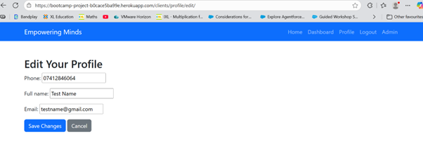

# Empowering Minds - Client Booking Platform

Empowering Minds is a web application that allows clients to manage their coaching appointments. Users can sign up, log in, view, create, edit, and cancel appointments, and update their profile information. The platform focuses on an intuitive and empowering user experience.

---

## 🧩 User Experience Design

The design of **Empowering Minds** focuses on providing a smooth and intuitive experience for clients seeking coaching services.

### Goals
- Quick and simple signup/login
- Easy appointment management (view, create, edit, cancel)
- Clear navigation and responsive design
- Clean, readable interface across all devices

### User Stories

#### As a New Client:
- I want to create an account using my email so I can access my dashboard.
- I want a confirmation message after signup so I know my account was created.
- I want a simple login form so I can access my account quickly.

#### As a Logged-in Client:
- I want to view all my upcoming appointments on my dashboard to stay organized.
- I want to book a new appointment using a simple form.
- I want to edit existing appointments if my schedule changes.
- I want to cancel appointments easily if I can’t attend.
- I want to update my profile (name, email, phone) to keep my details accurate.
- I want to log out securely when done.

#### As an Admin:
- I want to log in to the admin panel to manage clients and appointments.

---

## ✨ Features

- **User Authentication:** Sign up, login, logout.
- **Profile Management:** Edit personal details.
- **Appointment Management:** View, book, edit, cancel appointments.
- **Responsive Design:** Works on desktop, tablet, and mobile.
- **Notifications:** Appointment confirmations and updates.

## Wireframe

### Screenshots

**Home Page**  

**Dashboard / Appointments**  

**Profile Edit Form**  

**Phone Validation**  

**Complete set of screenshots**

---

## 🏃 Agile Project Board

The project was developed using Agile methodology.  
You can view the project board here: [Project Board Link](https://github.com/users/HafsaA85/projects/6)

---

## 🧪 Testing

Testing was performed to ensure that all features work as expected, including user authentication, appointment CRUD, and profile updates.

### Sample Test Cases
- Signup and login flow
- Appointment creation, editing, and deletion
- Profile editing
- Logout and session management

### Testing Screenshots
 

---

## 🚀 Deployment

The project is deployed on **Heroku**: [Deployed App Link](https://bootcamp-project-b0cace5ba99e.herokuapp.com/)  

Steps for deployment:
1. Push code to GitHub repository.
2. Connect GitHub repository to Heroku.
3. Configure environment variables in Heroku.
4. Run migrations and collect static files.
5. Open deployed application via Heroku URL.

---

## 📜 Credits

- Django framework for backend development
- Bootstrap 5 for UI styling
- Icons and design inspiration from [Bootstrap Icons](https://icons.getbootstrap.com/)
- Any external code snippets or libraries are credited within the code comments

---

## 🤖 Usage of AI

AI tools (ChatGPT) were used to assist in the development process, primarily to:

- Suggest improvements and optimizations for code I wrote.
- Help generate boilerplate for models, forms, views, and templates to save time.
- Debug issues in Django, HTML, and CSS.
- Ensure code readability and PEP 8 compliance.
- Provide guidance on best practices for UX/UI design.
- Assist in creating user stories and structuring the README.
- Offer advice for testing scripts and validation logic.

---

## 📌 Notes

- Replace all screenshot placeholders with actual images from your project.
- Replace project board and deployed app links with your real URLs.
- Keep README updated as features or workflows change.
