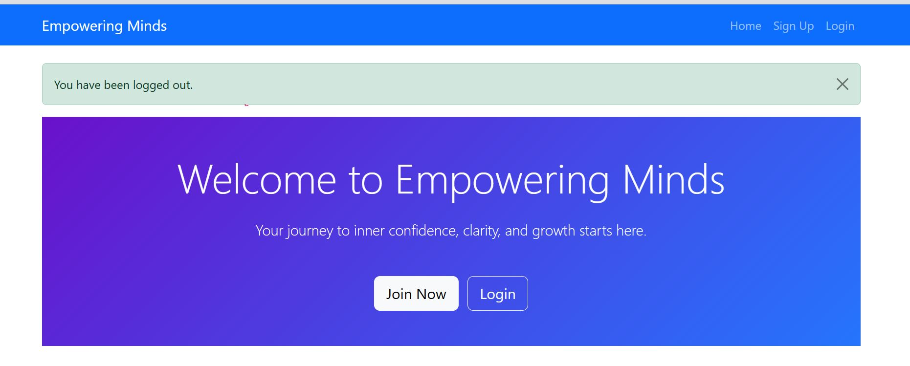

# Empowering Minds - Client Booking Platform

Empowering Minds is a web application that allows clients to manage their coaching appointments. Users can sign up, log in, view, create, edit, and cancel appointments, and update their profile information. The platform focuses on an intuitive and empowering user experience.

---

## 🧩 User Experience Design

The design of **Empowering Minds** focuses on providing a smooth and intuitive experience for clients seeking coaching services.

## 🧠 MoSCoW Prioritisation System

To manage the project effectively and ensure focus on essential features, the **MoSCoW prioritisation method** was used. This helped in deciding what needed to be developed first and what could be implemented later. Some of the could haves ben also implemented as time allowed.

| Priority | Description | Features |
|-----------|--------------|-----------|
| **Must Have** | Core features essential for the system to function. Without these, the project would fail to meet its objectives. | - User registration and login system<br>- Client dashboard<br>- Appointment booking functionality<br>- Secure data handling with authentication |
| **Should Have** | Important features that enhance usability but are not critical for initial deployment. | - Appointment editing and cancellation<br>- User profile management<br>- Mobile responsiveness |
| **Could Have** | Nice-to-have features that improve user experience but are not necessary for core functionality. | - Motivational quotes on the homepage<br>- Smooth animations and hover effects<br>- Enhanced visual design and layout improvements |
| **Won’t Have (This Time)** | Features intentionally excluded from this version due to time or scope constraints. May be added in future updates. | - Admin analytics dashboard<br>- Email/SMS appointment reminders<br>- Client feedback system |

This prioritisation ensured that all **Must Have** features were completed first to deliver a functional MVP (Minimum Viable Product), while still allowing room for future improvements.


### Goals
- Quick and simple signup/login
- Easy appointment management (view, create, edit, cancel)
- Clear navigation and responsive design
- Clean, readable interface across all devices

### User Stories

#### As a New Client:
- I want to create an account using my email so I can access my dashboard.
- I want a confirmation message after signup so I know my account was created.
- I want a simple login form so I can access my account quickly.

#### As a Logged-in Client:
- I want to view all my upcoming appointments on my dashboard to stay organized.
- I want to book a new appointment using a simple form.
- I want to edit existing appointments if my schedule changes.
- I want to cancel appointments easily if I can’t attend.
- I want to update my profile (name, email, phone) to keep my details accurate.
- I want to log out securely when done.

#### As an Admin:
- I want to log in to the admin panel to manage clients and appointments.

---

## ✨ Features

- **User Authentication:** Sign up, login, logout.
- **Profile Management:** Edit personal details.
- **Appointment Management:** View, book, edit, cancel appointments.
- **Responsive Design:** Works on desktop, tablet, and mobile.
- **Notifications:** Appointment confirmations and updates.

## Wireframe


## Entity-Relationship Diagram (ERD)

This diagram represents the main entities of the application and their relationships:

### Entities and Relationships

1. **User** (Django built-in)
   - Fields: `id` (PK), `username`, `email`, `password`, `first_name`, `last_name`, etc.

2. **Client**
   - Fields: `id` (PK), `user_id` (FK → User.id), `phone`
   - Relationship: One-to-One with User

3. **Appointment**
   - Fields: `id` (PK), `client_id` (FK → Client.id), `title`, `date`, `notes`
   - Relationship: Many-to-One with Client

4. **Notification**
   - Fields: `id` (PK), `client_id` (FK → Client.id), `message`, `read`, `timestamp`
   - Relationship: Many-to-One with Client

### ERD Diagram (Text Version)

+---------+ +---------+ +-------------+
| User |1 1| Client |1 *| Appointment |
+---------+-----------+---------+-----------+-------------+
| id | | id | | id |
| username| | user_id | FK--------| client_id |
| email | | phone | | title |
| password| +---------+ | date |
| ... | | notes |
+---------+ +-------------+
*
|
|
|
+-------------+
| Notification|
+-------------+
| id |
| client_id |
| message |
| read |
| timestamp |
+-------------+

### Must Have


### Could Have


### Notes

- Each **User** has exactly **one Client** profile.  
- Each **Client** can have **multiple Appointments**.  
- Each **Client** can have **multiple Notifications**.  
- This ERD helps visualize database relationships and is based on the current project models.


### Screenshots

**Home Page**  


**Dashboard / Appointments**  


**Profile Edit Form**  


**Phone Validation**  


**Site Responsiveness**


**Complete set of screenshots**


## Example screenshots


**Performance test 1**  


**Performance test 2**  


**Performance test 3**  


**Performance test 4**


---

## 🏃 Agile Project Board

The project was developed using Agile methodology.  
You can view the project board here: [Project Board Link](https://github.com/users/HafsaA85/projects/6)

---

## Automated Unit Tests

Automated tests have been implemented using Django's built-in testing framework (`django.test.TestCase`) to verify the functionality of the models and core application features.

### **1. Client Model Tests**

File: `clients/tests.py`

Example test:

```python
from django.test import TestCase
from .models import Client, Appointment
from django.contrib.auth.models import User

class ClientModelTest(TestCase):
    def setUp(self):
        self.user = User.objects.create_user(username='testuser', password='password')
        self.client_profile = Client.objects.create(user=self.user, phone='1234567890')

    def test_client_str(self):
        self.assertEqual(str(self.client_profile), 'testuser')


## Manual Test Procedures

The following manual tests were performed to verify the functionality of the Django full-stack application.

---

### **1. User/Client Sign Up**
**Steps:**
1. Navigate to the signup page.
2. Fill in valid `username`, `email`, `password`, and `phone` fields.
3. Submit the form.

**Expected Results:**
- User is created successfully.
- Client profile is linked to the new User.
- Phone number accepts only digits; any other input triggers a validation error.

---

### **2. User/Client Login**
**Steps:**
1. Navigate to the login page.
2. Enter correct credentials (username/email and password).
3. Submit the form.

**Expected Results:**
- User can log in successfully.
- Incorrect credentials display an error message: `"Please enter the correct username and password."`

---

### **3. Appointment Management**
**Steps:**
1. While logged in as a client, navigate to **Book New Appointment**.
2. Fill in `title`, `date`, and optional `notes`.
3. Submit the form.
4. Edit the appointment details.
5. Cancel/delete the appointment.

**Expected Results:**
- Appointment is created and linked to the logged-in client.
- Client can edit appointment details successfully.
- Client can cancel/delete the appointment.
- Notification messages appear at the top of the page for each action.

---

### **4. Admin Management**
**Steps:**
1. Log in as an admin.
2. Create a new client/user via the admin panel.
3. Edit existing client/user details.
4. Delete a client/user.

**Expected Results:**
- Admin can perform all create, edit, and delete operations on users/clients.
- Non-admin users cannot access admin login or admin pages.

---

### **5. Notifications**
**Steps & Actions:**
- User creation
- Login
- Edit profile
- Add/Edit appointment
- Delete/Cancel appointment

**Expected Results:**
- A notification message appears at the top of the page for each action.
- Messages are clear and correspond to the performed action, e.g.:
  - `"Client profile created successfully."`
  - `"Logged in successfully."`
  - `"Profile updated successfully."`
  - `"Appointment added successfully."`
  - `"Appointment deleted successfully."`

---

### **6. Phone Number Validation**
**Steps:**
1. Enter letters, special characters, or mixed input in the phone field during signup or profile edit.
2. Submit the form.

**Expected Results:**
- Form validation prevents submission.
- Error message is displayed: `"Enter a valid phone number containing only digits."`

---

### **7. Security / Role Restrictions**
**Steps:**
1. Attempt to log in as a non-admin user to the admin panel.
2. Attempt to perform admin actions with a client account.

**Expected Results:**
- Non-admin users cannot access admin pages or perform admin actions.
- Proper error messages or redirects appear when unauthorized access is attempted.

---

### **Notes**
- All actions should trigger a notification at the top of the page.
- The application is fully functional in a browser with responsive design.
- Phone number validation and login error handling have been tested on multiple input cases.


### Testing Screenshots
 


### Performance test

## Note
- A class feloow checked and the performance was showing low. But it was not showing when I testes.
- I fixed suggested errors and it still didn't work on my side.


---


## 🚀 Deployment

The project is deployed on **Heroku**: [Deployed App Link](https://bootcamp-project-b0cace5ba99e.herokuapp.com/)  

Steps for deployment:
1. Push code to GitHub repository.
2. Connect GitHub repository to Heroku.
3. Configure environment variables in Heroku.
4. Run migrations and collect static files.
5. Open deployed application via Heroku URL.

---

## 📜 Credits

- Django framework for backend development
- Bootstrap 5 for UI styling
- Icons and design inspiration from [Bootstrap Icons](https://icons.getbootstrap.com/)
- Any external code snippets or libraries are credited within the code comments
- For site responsiveness, used Am I Responsive website (https://ui.dev/amiresponsive?url=https://bootcamp-project-b0cace5ba99e.herokuapp.com/clients/)

---

## 🤖 Usage of AI

AI tools (ChatGPT) were used to assist in the development process, primarily to:

- Suggest improvements and optimizations for code I wrote.
- Help generate boilerplate for models, forms, views, and templates to save time.
- Debug issues in Django, HTML, and CSS.
- Ensure code readability and PEP 8 compliance.
- Provide guidance on best practices for UX/UI design.
- Assist in creating user stories and structuring the README.
- Offer advice for testing scripts and validation logic.


